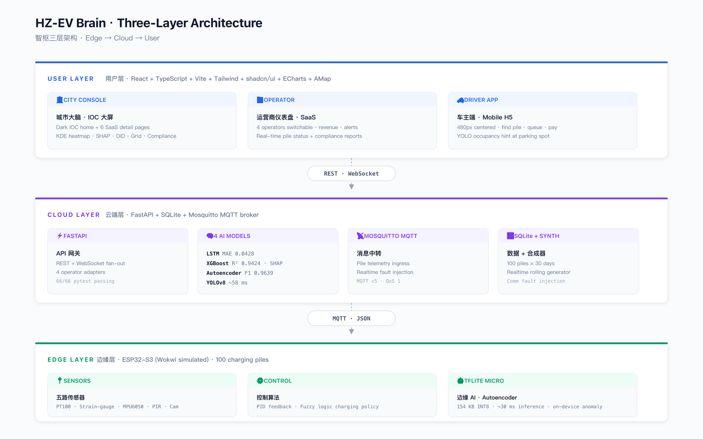

<div align="center">

# 智枢 · ZHISHU · HZ-EV Brain

### **Hangzhou EV-Charging City Brain — an AIoT Governance Platform**
*From Pile to Brain · From Charging to Governing*

[中文](./README.md) · [English](./README.en.md)

[](https://react.dev)
[](https://www.typescriptlang.org)
[](https://vitejs.dev)
[](https://fastapi.tiangolo.com)
[](https://pytorch.org)
[](https://xgboost.readthedocs.io)
[](https://docs.ultralytics.com)
[](https://wokwi.com)
[](https://www.tensorflow.org/lite/microcontrollers)
[](https://docs.docker.com/compose/)
[](./LICENSE)

</div>

> **City-scale, demo-driven, full-stack AIoT.** 100 charging piles across two
> Hangzhou districts, 4 mock operators behind a unified data plane, 4 AI models,
> 6 governance functions, an ESP32-S3 edge reference implementation — runnable
> end-to-end with one `docker-compose up`.

<div align="center">

🎬 **Demo Video** &nbsp;·&nbsp; <em>3-4 min product walkthrough — link will be embedded here once published</em><br/>
🌐 **Live Demo** &nbsp;·&nbsp; <em>Public VPS site — link will be added here once deployed</em>

</div>

---

## Why this project exists

In Hangzhou — birthplace of Alibaba's "City Brain" — the public charging network
is fragmented across four major operators (国家电网 / 特来电 / 星星充电 / 蔚来),
each with its own app, pricing, SLAs, and data formats. Drivers see only their
own operator; operators see only their own piles; **the city has no unified
view at all**. That gap motivates this portfolio piece.

**HZ-EV Brain** is the *city's* dashboard — the missing layer that ingests four
heterogeneous data shapes, layers four AI models on top, and surfaces six
governance decisions on a single big-screen IOC console plus two SaaS-flavoured
companion apps (Operator + Driver).

The project is **dashboard-led and 100% synthetic**: every byte of data is
generated by the [`backend/synth/`](./backend/synth/) module — see
[`docs/data-model.md`](./docs/data-model.md) for the methodology and how the
synthesis is validated against publicly available statistics from the China
Electric Vehicle Charging Infrastructure Promotion Alliance.

---

## Screenshots

<table>
  <tr>
    <td align="center" width="50%">
      
      <br/>
      <sub><b>1. City Console — IOC Big-Screen Home</b><br/>
      Live Hangzhou pile map · KPI strip · scrolling event stream · 3-mode switch (real-time / history / LSTM forecast).</sub>
    </td>
    <td align="center" width="50%">
      
      <br/>
      <sub><b>2. Site Selection ⭐ (flagship)</b><br/>
      Click anywhere on the Hangzhou map → XGBoost predicts 6-month utilization, SHAP explains the top-3 features.</sub>
    </td>
  </tr>
  <tr>
    <td align="center" width="50%">
      
      <br/>
      <sub><b>3. Grid Coordination</b><br/>
      Trigger a grid alert → SciPy LP allocates curtailment across 4 operators in &lt; 50 ms · animated load-recovery curve.</sub>
    </td>
    <td align="center" width="50%">
      
      <br/>
      <sub><b>4. Operator Compliance</b><br/>
      A/B/C/D rating for each of the 4 operators · SLA breaches · z-score price-anomaly badges · drill-down to single piles.</sub>
    </td>
  </tr>
  <tr>
    <td align="center" width="50%">
      
      <br/>
      <sub><b>5. Emergency Response</b><br/>
      Asian Games / typhoon / spring-festival triggers · YAML rule engine fans out · LSTM re-forecasts impact radius.</sub>
    </td>
    <td align="center" width="50%">
      
      <br/>
      <sub><b>6. Pile Detail + Edge AI</b><br/>
      YOLOv8 vehicle detection + Cloud-side autoencoder anomaly score + a deep link to the Wokwi-runnable ESP32-S3 firmware.</sub>
    </td>
  </tr>
</table>

---

## At a glance

<table>
  <tr>
    <td><b>🎯 Pitch</b></td>
    <td>The city-management layer that four operator apps don't give you.</td>
  </tr>
  <tr>
    <td><b>🏛️ Anchor</b></td>
    <td>Hangzhou — Future Tech City (西溪/阿里巴巴, 60 piles) + Qiantang New Area (钱塘新区, 40 piles).</td>
  </tr>
  <tr>
    <td><b>👤 Three audiences</b></td>
    <td>City Manager (IOC dark big-screen) · Operator (light SaaS) · Driver (mobile H5).</td>
  </tr>
  <tr>
    <td><b>🤖 AI surface area</b></td>
    <td>LSTM demand · XGBoost+SHAP site selection · Autoencoder anomaly (Cloud + Edge) · YOLOv8 vehicle detection.</td>
  </tr>
  <tr>
    <td><b>🔌 Edge reference</b></td>
    <td>ESP32-S3 firmware running TFLite-Micro autoencoder (154 KB) · 27-rule fuzzy safety governor · anti-windup PID · Wokwi-runnable.</td>
  </tr>
  <tr>
    <td><b>⚖️ Spec-driven</b></td>
    <td><a href="./contracts/"><code>contracts/</code></a> holds OpenAPI 3.1, AsyncAPI 2.6, and four operator JSON Schemas — the wire format is the source of truth.</td>
  </tr>
  <tr>
    <td><b>📦 Runtime</b></td>
    <td><code>docker-compose up</code> brings up backend + Mosquitto + frontend; SQLite seeds itself on first boot.</td>
  </tr>
</table>

---

## Architecture


<p align="center">
  
</p>


> See [`docs/architecture.md`](./docs/architecture.md) for the full deep-dive
> (data flow, WebSocket fan-out, adapter pattern for the four operators,
> container topology). The 100 m radio-link selection is justified separately
> in [`docs/radio-link-analysis.md`](./docs/radio-link-analysis.md).

---

## Quick start

```bash
git clone https://github.com/lucifer-holly/hangzhou-ev-brain.git
cd hangzhou-ev-brain
cp .env.example .env          # set VITE_AMAP_KEY if you have one (OSM works otherwise)
docker-compose up --build     # backend + mosquitto + frontend
```

Open http://localhost:5173 — the City Console seeds 30 days of synthetic
history on first boot (≈ 30 s) and starts streaming 1 Hz live ticks over
WebSocket. The four AI endpoints are reachable on http://localhost:8000/docs.

| Service | URL | Purpose |
|---|---|---|
| Frontend | http://localhost:5173 | City Console / Operator / Driver |
| Backend  | http://localhost:8000/docs | FastAPI Swagger UI (REST + WS) |
| Mosquitto| `mqtt://localhost:1883` | MQTT broker for the ESP32 demo |

For the edge-AI demo, open `firmware/pile-simulator/` in VS Code with the
[Wokwi extension](https://marketplace.visualstudio.com/items?itemName=wokwi.wokwi-vscode)
or paste `diagram.json` into [wokwi.com](https://wokwi.com) — see
[`firmware/pile-simulator/README.md`](./firmware/pile-simulator/README.md).

---

## Project structure

```
hangzhou-ev-brain/
├── README.md / README.en.md   ← bilingual hero (you are here)
├── docker-compose.yml          one-command boot
├── .env.example
├── docs/                       architecture · data-model · ai-models · radio · design
│   └── images/                 screenshots/
├── contracts/ ★                OpenAPI 3.1 + AsyncAPI 2.6 + 4 operator JSON Schemas
├── backend/                    FastAPI + synth + 4 AI models + MQTT + SQLite
│   ├── api/                    REST routers + WebSocket
│   ├── synth/                  100-pile geography + demand model + fault injector
│   ├── ai/                     lstm_demand · site_selection · anomaly_detection · yolo_occupancy
│   └── tests/
├── frontend/                   React 18 + TS 5 + Vite + Tailwind + shadcn/ui + ECharts + AMap
│   └── src/{design-tokens,components/{ioc,map},pages/{city-console,operator,driver}}
├── firmware/pile-simulator/    ESP32-S3 (Wokwi) — PID + Fuzzy + TFLite-Micro autoencoder
├── infra/mosquitto/            broker config
└── scripts/                    train_all_models.sh + reproducibility helpers
```

★ The [`contracts/`](./contracts/) folder is the single source of truth for
every wire format. Frontend and backend never cross-import types — both read
from this folder. See [`contracts/README.md`](./contracts/README.md).

---

## Six governance functions

| # | Function | One-liner | Algorithm |
|---|---|---|---|
| 1 | **City demand heatmap** | "Where is the city tight or slack right now?" | KDE aggregation + LSTM 1-h forecast |
| 2 | **Site selection ⭐** | "If we build N piles here, what's the 6-month utilization?" | XGBoost + SHAP (interpretable) |
| 3 | **Grid coordination** | "Allocate curtailment when the grid screams." | SciPy linear programming |
| 4 | **Operator compliance** | "Audit SLA + flag price anomalies, A/B/C/D each operator." | z-score (≥ 2σ from city median) |
| 5 | **Emergency response** | "Asian Games / typhoon scenarios → fan out directives." | YAML rule engine + LSTM re-forecast |
| 6 | **Subsidy effectiveness** | "Which subsidies actually moved utilization?" | Difference-in-Differences (DID) |

See [`frontend/src/pages/city-console/`](./frontend/src/pages/city-console/) — one
page per function. Each page has both the IOC dark big-screen entry and a SaaS
light detail view.

---

## Four AI models

| Model | Purpose | Framework | Deployment | Parameters |
|---|---|---|---|---|
| **LSTM** | hourly demand prediction | PyTorch | FastAPI endpoint | ~50 K |
| **XGBoost + SHAP** ⭐ | interpretable site selection | xgboost + shap | FastAPI endpoint | ~100 trees |
| **Autoencoder** | per-pile anomaly detection | PyTorch → TFLite (INT8) | **Cloud + Edge** dual-track | ~70 K |
| **YOLOv8** | parking-bay vehicle detection | Ultralytics (pretrained) | FastAPI on demand | ~3 M (n) |

Detailed engineering notes — architecture, training data, eval methodology,
SHAP screenshots — live in [`docs/ai-models.md`](./docs/ai-models.md).

### Performance metrics (measured)

| Model | Spec target | **Measured** |
|---|---|---|
| LSTM demand | MAE &lt; 0.08 | **MAE 0.0428** |
| XGBoost site selection | R² &gt; 0.85 | **R² 0.9424** · MAE 0.030 |
| Autoencoder anomaly (Cloud) | F1 &gt; 0.85 | **F1 0.9639** · P 0.93 · R 1.00 |
| Autoencoder anomaly (Edge / TFLite Micro) | runs on ESP32-S3 | **~30 ms** inference · **154 KB** model |
| YOLOv8 occupancy | smoke-test runs | **~50–150 ms** / image (CPU, single-threaded) |

Reproduce with:

```bash
cd backend
./scripts/train_all_models.sh
python -m ai.eval.benchmark        # prints the table above + PASS/FAIL gates
```

---

## Tech stack

<div align="center">

**Frontend** — React 18 · TypeScript 5 · Vite · Tailwind · shadcn/ui · ECharts · AMap (高德 JS API 2.0) · React-Leaflet (OSM fallback) · Framer Motion · Zustand · TanStack Query

**Backend** — FastAPI · Pydantic v2 · SQLAlchemy 2.0 (async) · APScheduler · paho-mqtt · NumPy / SciPy / pandas / scikit-learn

**AI** — PyTorch · XGBoost · SHAP · Ultralytics (YOLOv8) · ONNX Runtime · TFLite Micro

**Edge** — ESP32-S3 · PlatformIO · Arduino-ESP32 · TensorFlow Lite Micro (chmorgan port)

**Infra** — Docker Compose · Eclipse Mosquitto 2 · SQLite (aiosqlite) · Spec-driven contracts (OpenAPI 3.1 / AsyncAPI 2.6)

</div>

---

## Documentation

| Document | What's inside |
|---|---|
| [`docs/spec.md`](./docs/spec.md) | The complete **design specification** — 14 chapters, ~26 KB. Always the canonical reference. |
| [`docs/architecture.md`](./docs/architecture.md) | Three-layer architecture, data flow, WebSocket fan-out, adapter pattern, container topology. |
| [`docs/data-model.md`](./docs/data-model.md) | **Synthetic-data methodology** — geographic distribution, demand model, fault injection, validation. |
| [`docs/ai-models.md`](./docs/ai-models.md) | Engineering notes for each of the 4 models — architecture, training, eval, deployment. |
| [`docs/radio-link-analysis.md`](./docs/radio-link-analysis.md) | 100 m link selection — 8-protocol comparison, Shannon-Hartley derivation, FSPL link budget. |
| [`docs/design-system.md`](./docs/design-system.md) | Tokens, components, visual decoration, design references (阿里 ET 城市大脑 / 海康 / Geovis). |
| [`contracts/README.md`](./contracts/README.md) | Why a `contracts/` directory; OpenAPI / AsyncAPI / 4 operator JSON Schemas. |
| [`firmware/pile-simulator/README.md`](./firmware/pile-simulator/README.md) | ESP32-S3 firmware — PID + Fuzzy + TFLite Micro on-device anomaly detection. |

---

## Deployment options

This project is designed to run **locally as a portfolio demo**. Three paths:

1. **Local (recommended)** — `docker-compose up`. SQLite + Mosquitto are
   embedded; nothing leaves your machine.
2. **Cloud-light** — a static frontend on **Vercel** + the backend on
   **Render / Fly.io / Railway**. The backend image is ~ 1.6 GB (PyTorch +
   YOLO weights), so a free tier may not fit; pinning to `cpu-only` PyTorch
   wheels brings it to ~ 700 MB.
3. **Self-hosted** — any machine with Docker. The included `docker-compose.yml`
   is the canonical recipe; pair it with Caddy / Traefik for HTTPS if needed.

Authentication, HTTPS, observability, and database migrations are
**deliberately out of scope** for this portfolio (see
[`docs/spec.md` §12](./docs/spec.md)).

---

## Project status

| Component | Status |
|---|---|
| Backend (FastAPI + synth + AI + MQTT) | ✅ complete |
| Frontend (3 consoles + 6 detail pages) | ✅ complete |
| ESP32-S3 firmware (Wokwi) | ✅ complete with on-device autoencoder |
| Spec-driven contracts | ✅ complete |
| Documentation pack (this folder) | ✅ complete |
| Demo video | ⏳ in progress |
| Public VPS deployment + demo site | ⏳ planned |

---

## License

[MIT](./LICENSE) © 2026 — see [`LICENSE`](./LICENSE) and [`NOTICE`](./NOTICE)
for the full open-source attribution list.

Contributions welcome — see [`CONTRIBUTING.md`](./CONTRIBUTING.md).

---

<div align="center">

**智枢 · ZHISHU · HZ-EV Brain** — an open-source end-to-end AIoT demo,
independently built and inspired by the author's work on a Hong Kong
smart-charging government project.

*From Pile to Brain — From Charging to Governing.*

</div>
