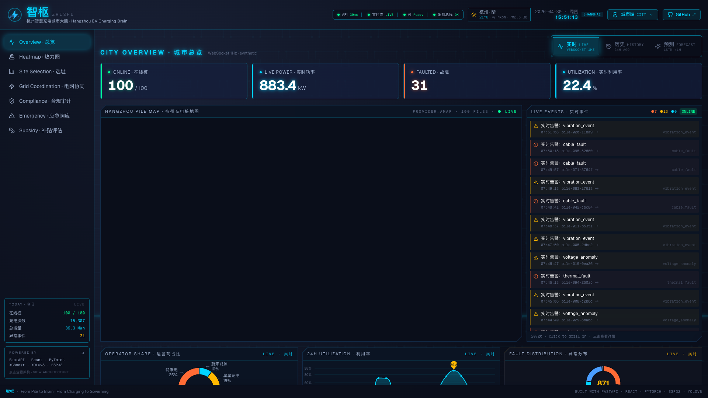
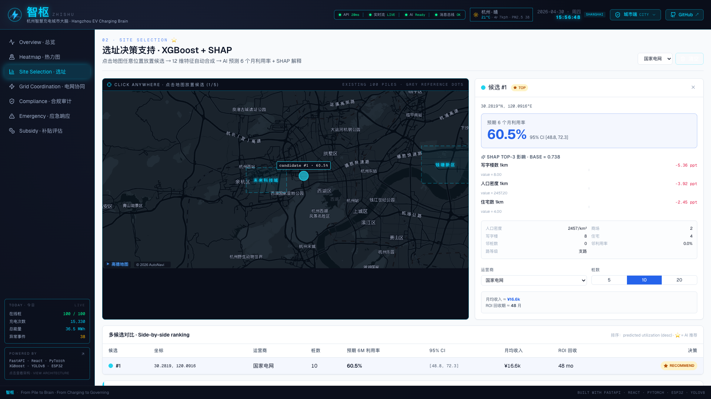
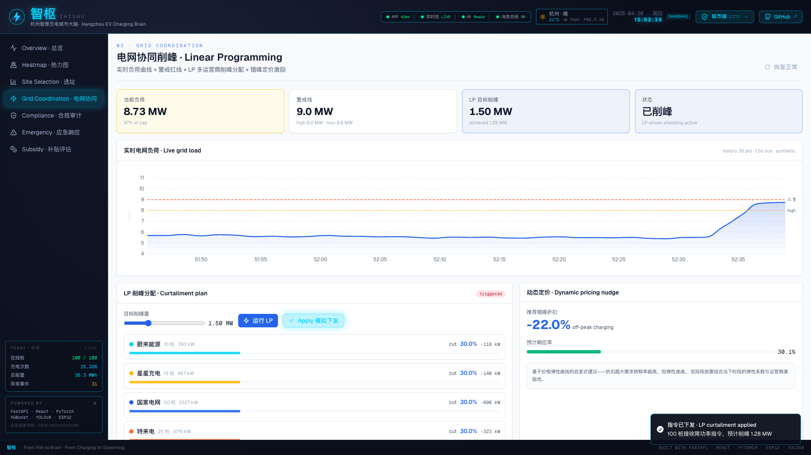
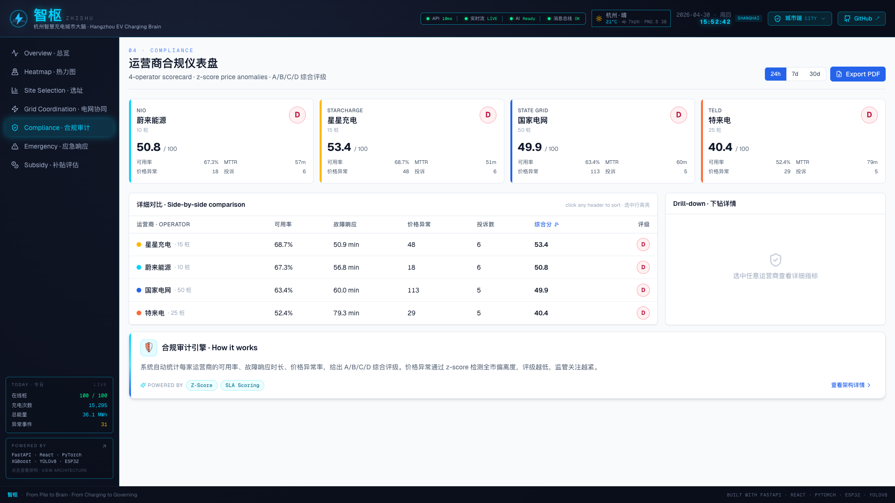
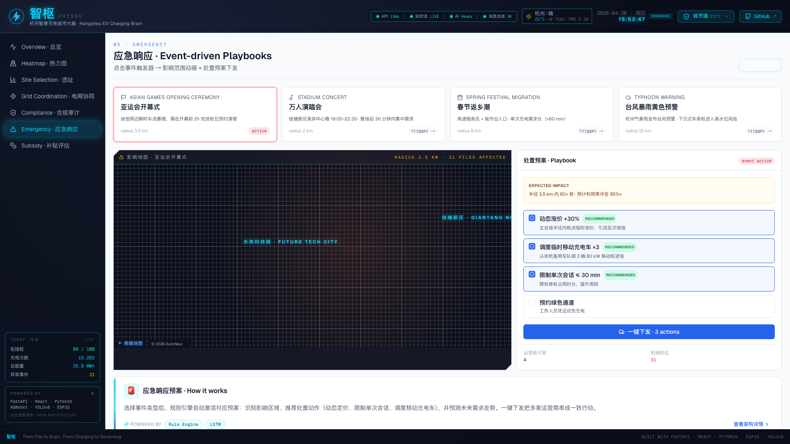
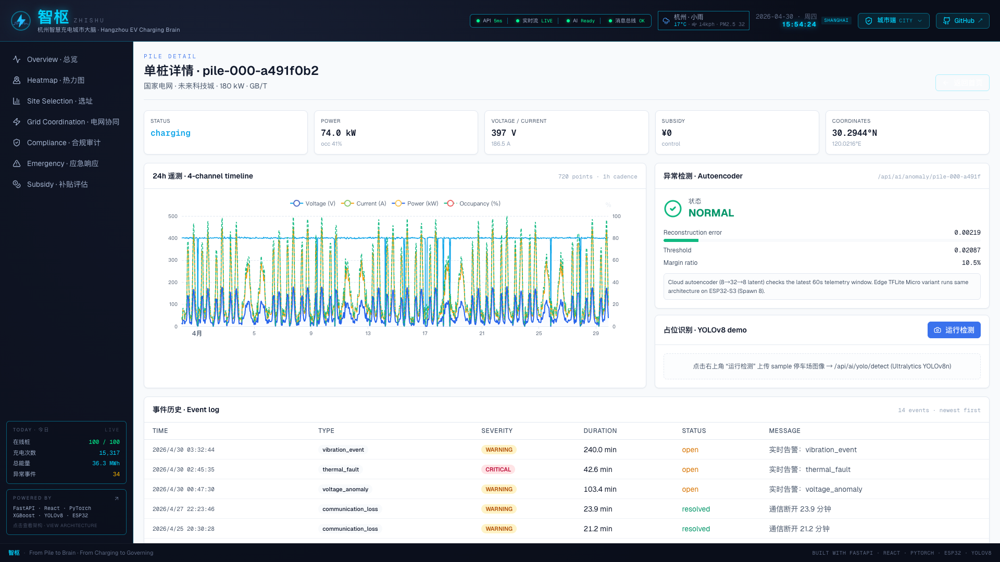

<div align="center">

# 智枢 · ZHISHU · HZ-EV Brain

### **杭州智慧充电城市大脑 — 一个 AIoT 治理平台**
*From Pile to Brain · From Charging to Governing*

[English](./README.md) · [中文](./README.zh.md)

[](https://react.dev)
[](https://www.typescriptlang.org)
[](https://vitejs.dev)
[](https://fastapi.tiangolo.com)
[](https://pytorch.org)
[](https://xgboost.readthedocs.io)
[](https://docs.ultralytics.com)
[](https://wokwi.com)
[](https://www.tensorflow.org/lite/microcontrollers)
[](https://docs.docker.com/compose/)
[](./LICENSE)

</div>

> **城市级、演示驱动、全栈 AIoT。** 杭州两区 100 个充电桩、4 家运营商
> mock 数据合并、4 个 AI 模型、6 个治理功能、ESP32-S3 边缘参考实现 ——
> `docker-compose up` 一行端到端跑通。

<!-- VIDEO_PLACEHOLDER -->
<!-- LIVE_DEMO_PLACEHOLDER -->

---

## 这个项目是什么

杭州是阿里"城市大脑"的发源地，但杭州的公共充电网络至今仍由四家头部运营商
（**国家电网 / 特来电 / 星星充电 / 蔚来**）各自为政——APP 各做各的、价格
不透明、SLA 不统一、数据格式互不兼容。司机只看得到自己 APP 里的桩，运营商
只看得到自己的桩，**城市层完全没有统一视图**。

**HZ-EV Brain（智枢）** 就是补上这个空缺：把四种异构数据收进统一底座，
叠 4 个 AI 模型，给市级管理者输出 6 个治理决策。配套两个轻量级前端
（运营商 SaaS 仪表盘 + 司机 H5）。

项目是 **dashboard-led 且 100% 合成数据**。所有数据由
[`backend/synth/`](./backend/synth/) 生成 —— 方法论与公开数据
（中国电动汽车充电基础设施促进联盟）的对照见
[`docs/data-model.md`](./docs/data-model.md)。

---

## 截图

<!-- 6 个截图占位，Spawn 10 会替换为真实 PNG。 -->

<table>
  <tr>
    <td align="center" width="50%">
      
      <br/>
      <sub><b>1. City Console — IOC 大屏首页</b><br/>
      杭州充电桩实时地图 · KPI 横条 · 滚动事件流 · 三模式切换（实时 / 历史 / LSTM 预测）。</sub>
    </td>
    <td align="center" width="50%">
      
      <br/>
      <sub><b>2. 选址决策 ⭐（旗舰）</b><br/>
      点击杭州地图任意位置 → XGBoost 预测 6 个月利用率，SHAP 给出 Top-3 特征贡献。</sub>
    </td>
  </tr>
  <tr>
    <td align="center" width="50%">
      
      <br/>
      <sub><b>3. 电网协同削峰</b><br/>
      触发电网告急 → SciPy 线性规划 &lt; 50 ms 内分配削峰 · 负荷恢复曲线动画。</sub>
    </td>
    <td align="center" width="50%">
      
      <br/>
      <sub><b>4. 运营商合规审计</b><br/>
      4 家运营商 A/B/C/D 评级 · SLA 违规 · z-score 价格异常徽章 · 单桩级 drill-down。</sub>
    </td>
  </tr>
  <tr>
    <td align="center" width="50%">
      
      <br/>
      <sub><b>5. 应急响应</b><br/>
      亚运 / 台风 / 春节触发器 · YAML 规则引擎 fan-out · LSTM 重新预测影响半径。</sub>
    </td>
    <td align="center" width="50%">
      
      <br/>
      <sub><b>6. 单桩详情 + 边缘 AI</b><br/>
      YOLOv8 车辆检测 + 云端 Autoencoder 异常评分 + 跳转至 Wokwi 可运行的 ESP32-S3 固件。</sub>
    </td>
  </tr>
</table>

> 现为占位图，Spawn 10 替换为真实 PNG 截图。

---

## 一眼看懂

<table>
  <tr>
    <td><b>🎯 卖点</b></td>
    <td>四家运营商 APP 没有的、城市管理层那一层。</td>
  </tr>
  <tr>
    <td><b>🏛️ 锚定区域</b></td>
    <td>杭州 — 未来科技城（西溪 / 阿里巴巴，60 桩）+ 钱塘新区（40 桩）。</td>
  </tr>
  <tr>
    <td><b>👤 三类用户</b></td>
    <td>城市管理（IOC 深色大屏）· 运营商（浅色 SaaS）· 司机（移动 H5）。</td>
  </tr>
  <tr>
    <td><b>🤖 AI 能力面</b></td>
    <td>LSTM 需求预测 · XGBoost+SHAP 选址 · Autoencoder 异常检测（云 + 边）· YOLOv8 车辆识别。</td>
  </tr>
  <tr>
    <td><b>🔌 边缘参考实现</b></td>
    <td>ESP32-S3 跑 TFLite Micro autoencoder（154 KB）· 27 条规则模糊安全门 · 抗 windup PID · Wokwi 浏览器可运行。</td>
  </tr>
  <tr>
    <td><b>⚖️ Spec-Driven</b></td>
    <td><a href="./contracts/"><code>contracts/</code></a> 里有 OpenAPI 3.1、AsyncAPI 2.6、四份运营商 JSON Schema —— wire format 是唯一真相。</td>
  </tr>
  <tr>
    <td><b>📦 启动方式</b></td>
    <td><code>docker-compose up</code> 一行起 backend + Mosquitto + frontend；SQLite 首次启动自动 seed。</td>
  </tr>
</table>

---

## 系统架构

<p align="center">
  
</p>

> 完整深度版见 [`docs/architecture.md`](./docs/architecture.md)（数据流、
> WebSocket 推送、4 运营商 adapter 模式、容器拓扑）。
> 100m 无线选型推导见 [`docs/radio-link-analysis.md`](./docs/radio-link-analysis.md)。

---

## 快速启动

```bash
git clone https://github.com/your-username/hz-ev-brain.git
cd hz-ev-brain
cp .env.example .env          # 有高德 key 就填 VITE_AMAP_KEY；没有就用 OSM
docker-compose up --build     # 起 backend + mosquitto + frontend
```

打开 http://localhost:5173 —— City Console 首次启动会 seed 30 天合成历史
（约 30s），然后开始 1 Hz 实时推送。后端的 4 个 AI 接口在
http://localhost:8000/docs 直接可点。

| 服务 | URL | 用途 |
|---|---|---|
| 前端 | http://localhost:5173 | City Console / Operator / Driver |
| 后端 | http://localhost:8000/docs | FastAPI Swagger UI（REST + WS）|
| MQTT | `mqtt://localhost:1883` | ESP32 demo 用 broker |

边缘 AI demo：在 VS Code 里装
[Wokwi 扩展](https://marketplace.visualstudio.com/items?itemName=wokwi.wokwi-vscode)
打开 `firmware/pile-simulator/`，或在 [wokwi.com](https://wokwi.com) 粘贴
`diagram.json`。详见 [`firmware/pile-simulator/README.md`](./firmware/pile-simulator/README.md)。

---

## 项目结构

```
hz-ev-brain/
├── README.md / README.zh.md   ← 双语 hero（你正在看）
├── docker-compose.yml          一键启动
├── .env.example
├── docs/                       架构 · 数据 · AI · 无线 · 设计
│   └── images/                 architecture.svg + screenshots/
├── contracts/ ★                OpenAPI 3.1 + AsyncAPI 2.6 + 4 份运营商 JSON Schema
├── backend/                    FastAPI + synth + 4 AI 模型 + MQTT + SQLite
│   ├── api/                    REST routers + WebSocket
│   ├── synth/                  100 桩地理 + 需求模型 + 故障注入器
│   ├── ai/                     lstm_demand · site_selection · anomaly_detection · yolo_occupancy
│   └── tests/
├── frontend/                   React 18 + TS 5 + Vite + Tailwind + shadcn/ui + ECharts + AMap
│   └── src/{design-tokens,components/{ioc,map},pages/{city-console,operator,driver}}
├── firmware/pile-simulator/    ESP32-S3（Wokwi）— PID + Fuzzy + TFLite Micro autoencoder
├── infra/mosquitto/            broker 配置
└── scripts/                    train_all_models.sh + 复现脚本
```

★ [`contracts/`](./contracts/) 是所有 wire format 的唯一真相。前后端不交叉
import 类型 —— 都从这个目录读。详见 [`contracts/README.md`](./contracts/README.md)。

---

## 6 个治理功能

| # | 功能 | 一句话定位 | 算法 |
|---|---|---|---|
| 1 | **全城供需热力图** | "现在哪里挤、哪里空？" | KDE 聚合 + LSTM 1h 预测 |
| 2 | **选址决策支持 ⭐** | "在这建 N 根桩，6 个月后利用率多少？" | XGBoost + SHAP（可解释）|
| 3 | **电网协同削峰** | "电网告急时把削峰指令分给谁？" | SciPy 线性规划 |
| 4 | **运营商合规审计** | "审计 SLA + 价格异常，4 家运营商打 A/B/C/D。" | z-score（市中位 ≥ 2σ）|
| 5 | **应急响应** | "亚运 / 台风 / 演唱会怎么调度？" | YAML 规则引擎 + LSTM 复用 |
| 6 | **补贴效果评估** | "哪笔补贴真的拉动了利用率？" | DID 因果推断 |

代码：[`frontend/src/pages/city-console/`](./frontend/src/pages/city-console/) ——
每个功能一页，每页有 IOC 深色入口和 SaaS 浅色详情两套视图。

---

## 4 个 AI 模型

| 模型 | 用途 | 框架 | 部署 | 参数量 |
|---|---|---|---|---|
| **LSTM** | 小时级需求预测 | PyTorch | FastAPI 接口 | ~50 K |
| **XGBoost + SHAP** ⭐ | 可解释选址 | xgboost + shap | FastAPI 接口 | ~100 棵树 |
| **Autoencoder** | 单桩异常检测 | PyTorch → TFLite (INT8) | **云 + 边** 双轨 | ~70 K |
| **YOLOv8** | 车位车辆识别 | Ultralytics（预训练）| FastAPI 按需 | ~3 M (n) |

工程化文档（架构、训练、评估、部署、SHAP 截图）见
[`docs/ai-models.md`](./docs/ai-models.md)。

### 性能指标（已实测）

| 模型 | Spec 目标 | **实测** |
|---|---|---|
| LSTM 需求预测 | MAE &lt; 0.08 | **MAE 0.0428** |
| XGBoost 选址 | R² &gt; 0.85 | **R² 0.9424** · MAE 0.030 |
| Autoencoder（云端）| F1 &gt; 0.85 | **F1 0.9639** · P 0.93 · R 1.00 |
| Autoencoder（边缘 / TFLite Micro）| 能在 ESP32-S3 跑 | **~30 ms** 推理 · **154 KB** 模型 |
| YOLOv8 车辆识别 | smoke 跑通 | **~50–150 ms / 张**（CPU 单线程）|

复现：

```bash
cd backend
./scripts/train_all_models.sh
python -m ai.eval.benchmark        # 打印上表 + PASS/FAIL gates
```

---

## 技术栈

<div align="center">

**前端** — React 18 · TypeScript 5 · Vite · Tailwind · shadcn/ui · ECharts · AMap（高德 JS API 2.0）· React-Leaflet（OSM 备用）· Framer Motion · Zustand · TanStack Query

**后端** — FastAPI · Pydantic v2 · SQLAlchemy 2.0（async）· APScheduler · paho-mqtt · NumPy / SciPy / pandas / scikit-learn

**AI** — PyTorch · XGBoost · SHAP · Ultralytics（YOLOv8）· ONNX Runtime · TFLite Micro

**边缘** — ESP32-S3 · PlatformIO · Arduino-ESP32 · TensorFlow Lite Micro（chmorgan port）

**Infra** — Docker Compose · Eclipse Mosquitto 2 · SQLite（aiosqlite）· Spec-driven 合约（OpenAPI 3.1 / AsyncAPI 2.6）

</div>

---

## 文档

| 文档 | 内容 |
|---|---|
| [`docs/spec.md`](./docs/spec.md) | **完整设计文档** —— 14 章 ~26 KB，唯一规范出处 |
| [`docs/architecture.md`](./docs/architecture.md) | 三层架构、数据流、WebSocket fan-out、adapter 模式、容器拓扑 |
| [`docs/data-model.md`](./docs/data-model.md) | **合成数据方法论** —— 地理分布、需求模型、故障注入、与公开数据对照 |
| [`docs/ai-models.md`](./docs/ai-models.md) | 4 个模型的工程化文档（架构、训练、评估、部署）|
| [`docs/radio-link-analysis.md`](./docs/radio-link-analysis.md) | 100m 链路选型 —— 8 协议对比、Shannon-Hartley 推导、FSPL 链路预算 |
| [`docs/design-system.md`](./docs/design-system.md) | Token、组件、视觉装饰、设计参考（阿里 ET 城市大脑 / 海康 / Geovis）|
| [`contracts/README.md`](./contracts/README.md) | `contracts/` 目录原因 + OpenAPI / AsyncAPI / 4 运营商 JSON Schema |
| [`firmware/pile-simulator/README.md`](./firmware/pile-simulator/README.md) | ESP32-S3 固件 —— PID + Fuzzy + 端侧 TFLite Micro 异常检测 |

---

## 部署选项

本项目设计为**本地 portfolio demo**。三条路径：

1. **本地（推荐）** —— `docker-compose up`。SQLite + Mosquitto 内嵌，
   不依赖外部服务。
2. **轻云端** —— 前端发到 **Vercel**，后端发到 **Render / Fly.io / Railway**。
   后端镜像 ~ 1.6 GB（PyTorch + YOLO 权重）；锁 `cpu-only` PyTorch wheel
   可降到 ~ 700 MB。
3. **自部署** —— 任何能跑 Docker 的机器。`docker-compose.yml` 是配方，
   需要 HTTPS 配 Caddy / Traefik。

认证、HTTPS、可观测性、数据库迁移**都不在范围内**（决策见
[`docs/spec.md` §13](./docs/spec.md)）。

---

## 项目状态

| 模块 | 状态 |
|---|---|
| Backend（FastAPI + synth + AI + MQTT）| ✅ 完成 |
| Frontend（3 控制台 + 6 详情页）| ✅ 完成 |
| ESP32-S3 固件（Wokwi）| ✅ 完成（端侧 autoencoder 已上）|
| Spec-driven 合约 | ✅ 完成 |
| 文档包（本目录）| ✅ 完成（Spawn 9）|
| Demo 视频 | ⏳ Spawn 10 |
| 课程 PPT | ⏳ Spawn 11 |

---

## License

[MIT](./LICENSE) © 2026 —— 所有第三方依赖归属见
[`LICENSE`](./LICENSE) 与 [`NOTICE`](./NOTICE)。

欢迎贡献，详见 [`CONTRIBUTING.md`](./CONTRIBUTING.md)。

---

<div align="center">

**智枢 · ZHISHU · HZ-EV Brain** —— 从香港城市大学 *EIE 532 AIoT Technologies*
研究生课程作业开始，发现题目值得做大，于是扩展成完整 portfolio。

*From Pile to Brain — From Charging to Governing.*

</div>
