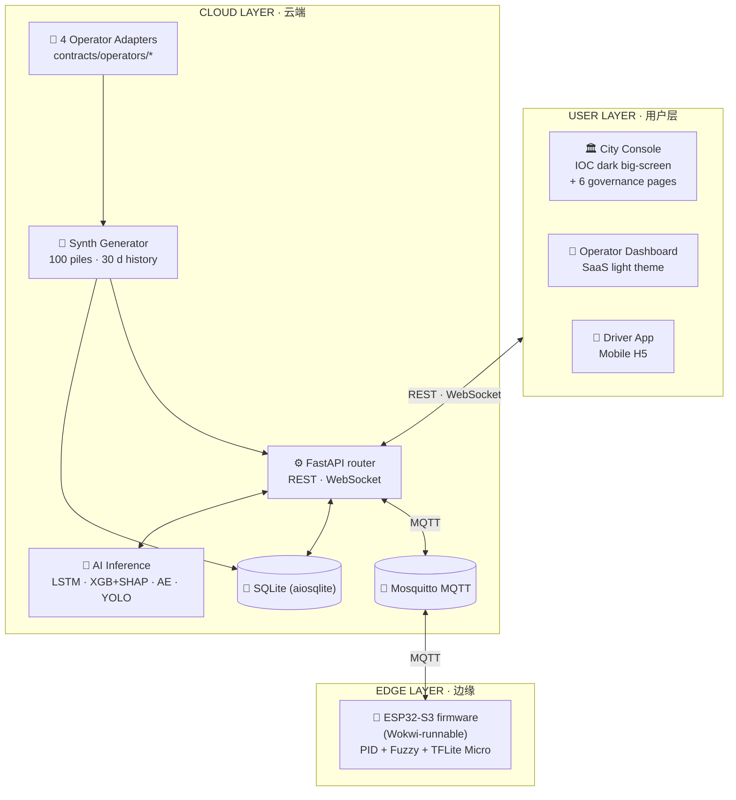
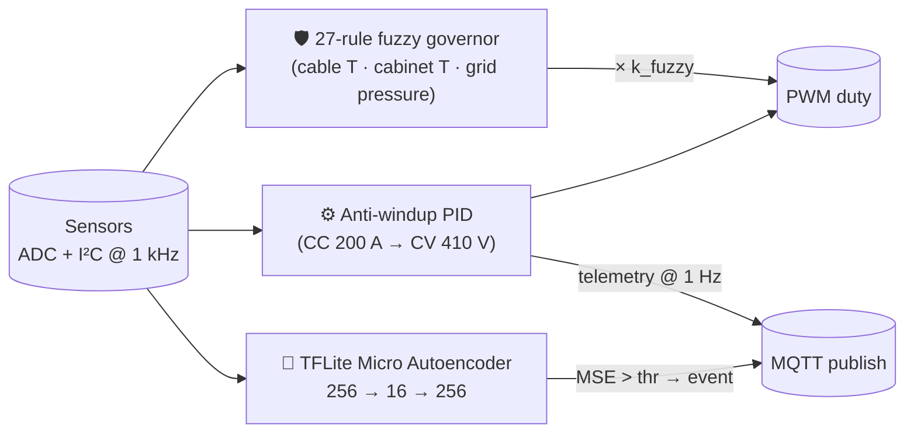
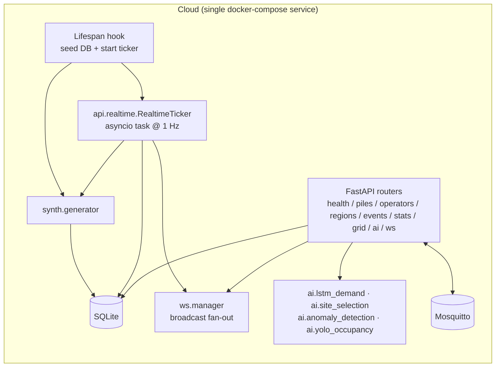
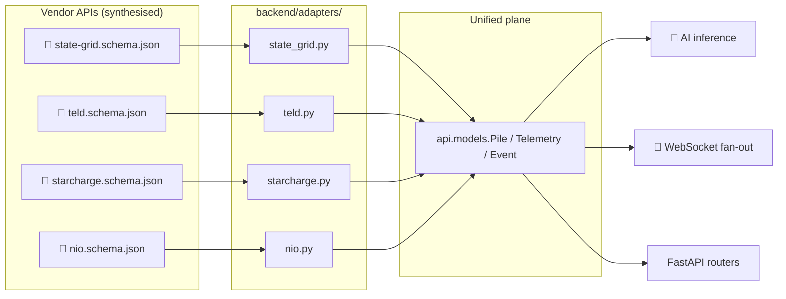
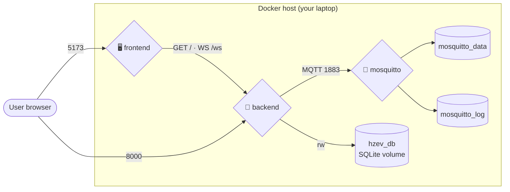

# Architecture · 系统架构

> Deep-dive companion to [`docs/spec.md`](./spec.md) §3-4. This document
> expands the three-layer overview into a 3 000-word engineering write-up
> with diagrams and rationale.

---

## 1. Why three layers?

HZ-EV Brain follows the canonical **Edge / Cloud / User** AIoT separation
because each layer has a fundamentally different load and latency profile:

| Layer | Optimised for | Communication |
|---|---|---|
| **Edge** (single pile) | sub-millisecond control loop, durability under power glitches | local I²C/SPI within the box; MQTT to cloud |
| **Cloud** (city-wide) | offline batch + ~1 Hz online inference, OLTP queries on history | REST + WebSocket toward the user, MQTT toward edge |
| **User** (3 consoles) | smooth 60 fps animations, generous big-screen layouts | REST for snapshots, WebSocket for live deltas |

This separation is what makes the demo's `docker-compose up` story believable:
each layer is a self-contained image that can be developed and benchmarked
independently. The edge image is even *more* independent — it lives in the
firmware Wokwi simulator and can be exercised without ever bringing the cloud
up. See [`firmware/pile-simulator/README.md`](../firmware/pile-simulator/README.md).

The block diagram below is the canonical one — it is also embedded in both
READMEs as `docs/images/architecture.svg`:



---

## 2. Edge layer — the single pile

### 2.1 Hardware budget (Wokwi-faithful)

The edge layer is implemented as a **single ESP32-S3-DevKitC-1**
running in Wokwi, with 11 simulated parts and 29 connections:

| Component | Sensor / actuator | GPIO |
|---|---|---|
| Voltage potentiometer (0-1 000 V proxy) | analog input | GPIO 1 (ADC1_CH0) |
| Current potentiometer (0-300 A proxy) | analog input | GPIO 2 (ADC1_CH1) |
| Cable NTC (-40 → 150 °C) | analog input | GPIO 3 (ADC1_CH2) |
| Cabinet NTC (-50 → 200 °C) | analog input | GPIO 4 (ADC1_CH3) |
| "PLUG" pushbutton | digital pull-up | GPIO 5 |
| "IMPACT" pushbutton (anomaly trigger) | digital pull-up | GPIO 6 |
| MPU6050 accel + gyro | I²C 0x68 | SDA = 8 / SCL = 9 |
| Servo (connector lock) | PWM | GPIO 10 |
| Buzzer | digital | GPIO 11 |
| Status RGB LED | 3 × digital | GPIO 17/18/19 |

The full pinout matches `firmware/pile-simulator/diagram.json` and
`include/config.h`. The firmware footprint is **RAM 26 % (85 KB / 320 KB)
and Flash 36 % (1.20 MB / 3.34 MB)**, which leaves comfortable headroom
for the TFLite-Micro autoencoder.

### 2.2 Three concurrent loops

The firmware is structured around three cooperative tasks rather than RTOS
threads, because the workload is small and FreeRTOS task switching adds noise
to the PID setpoint:



The fuzzy logic governor runs **in parallel** with the PID and acts as a
hard safety gate (saturate to 0 % duty regardless of PID demand if the
cable temperature exceeds 90 °C, etc.). The autoencoder reads from the
same ring buffer that feeds the PID — but its output is published as an
MQTT *event*, not consumed by the actuator path; this avoids a feedback
loop where a noisy AE prediction would shake the PID setpoint.

### 2.3 What the edge does *not* do

The edge ESP32 is a **reference implementation**, not part of the main
data plane. The City Console dashboard subscribes only to the synthetic
generator's tick stream (cloud → user) and never to the Wokwi MQTT
topics. This is a deliberate decoupling — the demo must be reproducible
without running the firmware, and the firmware demo must run without
needing the cloud or its DB.

If you want to bridge the two, set `MQTT_TOPIC_PREFIX=hzev/` in both
`backend/.env` and the firmware's `include/config.h`, and add an MQTT
subscriber router in `backend/api/`. We left this out of scope to keep
the spec simple.

---

## 3. Cloud layer — synthetic city, real services

### 3.1 The five pillars



The pieces:

1. **Routers** (`backend/api/routers/`). Eight FastAPI routers — most are
   thin wrappers over SQL-Alchemy queries, except `ai.py` (mounts the four
   models behind `/api/ai/*`) and `grid.py` (runs SciPy linear programming
   on demand for grid coordination).

2. **Lifespan** (`backend/api/main.py`). On startup we (1) seed 30 days
   of history if the DB is empty and (2) start the realtime ticker.
   Closure cancels the ticker. The seed is idempotent — re-running
   `docker-compose up` after killing it never duplicates rows.

3. **Synth** (`backend/synth/`). The deterministic data generator —
   the soul of the project. See [`data-model.md`](./data-model.md) for the
   full methodology. The two public callables are
   `generate_history(...)` (30 days × 24 h × 100 piles ≈ 72 K rows) and
   `generate_tick(...)` (one snapshot per pile per second).

4. **Realtime ticker** (`backend/api/realtime.py`). An `asyncio` task
   that fires `generate_tick` every `realtime_tick_seconds` (default
   1.0 s), updates the **live snapshot columns** on each `Pile` row
   (instead of writing 100 telemetry rows per second to SQLite), and
   broadcasts an aggregated WebSocket frame plus per-event frames.
   The aggregated frame design caps the WebSocket bandwidth to one
   serialisation per tick rather than 100.

5. **AI inference** (`backend/ai/`). Four sub-packages, one per
   model. The four models load lazily on first request; the FastAPI
   process caps `OMP_NUM_THREADS=1` to avoid the Apple-Silicon OpenMP
   collision between PyTorch / XGBoost / ONNXRuntime documented in
   [`backend/ai/eval/benchmark.py`](../backend/ai/eval/benchmark.py).

### 3.2 Data flow — three threads

Three concurrent flows traverse the cloud:

#### 🔼 Telemetry (synth → user)

```
APScheduler tick (1 Hz)
   └─ synth.generate_tick(piles, ticker_state) → (points, events)
       └─ session.bulk_update_mappings(Pile, …)         (DB write)
       └─ ws.manager.broadcast({type:'telemetry', …})    (frontend)
       └─ ws.manager.broadcast({type:'event', …}) × N
```

The frontend's `useWebSocket()` hook in
`frontend/src/hooks/useWebSocket.ts` projects this stream into a
`{ pileId → latestTelemetry }` dictionary plus a 50-event ring buffer.

#### 🔽 Governance commands (user → edge)

```
City Console "Trigger Grid Alert" button
   └─ POST /api/grid/curtail {target_kw}
       └─ scipy.linprog(c, A_ub, b_ub, …)                 (~50 ms)
       └─ MQTT publish system/grid/alert {operator_caps}  (broker fan-out)
       └─ POST /api/grid/curtail returns LP result        (front-end animation)
```

The same pattern applies to functions 4 (compliance — outbound MQTT to
push tariff updates), 5 (emergency — region-scoped MQTT topics), and
6 (subsidy adjustments — direct DB writes).

#### ↔ Heterogeneous integration (4 operators → unified plane)

```
Real operator API (out-of-scope for the demo, but designed for)
   └─ contracts/operators/<vendor>.schema.json               (source of truth)
       └─ backend/adapters/<vendor>.py                       (placeholder)
            └─ unified PileTelemetry / PileMetadata model
                └─ session.add(...) / session.execute(...)
```

The `contracts/operators/` JSON Schemas already capture each vendor's
naming + nesting style, so when a real adapter is wired up it does only
shape conversion — none of the downstream code (routers, AI inference,
front-end) ever sees the raw vendor format.

### 3.3 Why FastAPI + SQLite (and not ThingsBoard / TimescaleDB)

| Decision | Why we picked the simple option |
|---|---|
| **FastAPI over ThingsBoard** | ThingsBoard is a heavyweight Java daemon. We want `docker-compose up` to be ready in under a minute; a 50-line FastAPI app trumps a 1.5 GB JVM image for a portfolio. |
| **SQLite over TimescaleDB / Postgres** | 30 days × 24 h × 100 piles is 72 K rows; even the 1 Hz live snapshot fits in one `Pile` row update per tick. There is no scaling story for a demo, and SQLite means there's literally one file to mount in the volume. |
| **APScheduler over Celery** | Celery requires Redis or RabbitMQ; APScheduler is a pure-Python in-process scheduler. The realtime ticker is the only periodic job we need. |
| **paho-mqtt over an MQTT abstraction** | Mosquitto + paho is the canonical edge stack. No need to abstract over alternatives. |
| **Pydantic v2** | Validates incoming requests against the OpenAPI contract for free — and FastAPI emits the OpenAPI spec from those types, so `contracts/openapi.yaml` is auto-derived rather than hand-written. |

This stack lives as one Docker image (~ 1.6 GB because PyTorch + Ultralytics
weights are bundled). When a recruiter clones the repo, the entire cloud
is one container behind one Compose service — no DB migrations, no
secret management, no pre-flight checks.

---

## 4. Heterogeneous data governance — the adapter pattern

The four operators in this project's universe each ship a different
flavour of data. The `contracts/operators/` directory captures these
intentionally:

| Operator | Naming | Identity | Distinguishing field |
|---|---|---|---|
| **State Grid** (`state-grid`) | `snake_case`, formal | `SG-12345678` | `region_grid_code`, `tariff_book_version`, `last_inspection_date_yyyy_mm_dd` |
| **TELD** (`teld`) | `camelCase`, modern | UUID `stationId` | `pricing.peakHourMultiplier`, `session.userMaskedMobile` |
| **StarCharge** (`starcharge`) | `snake_case`, deeply nested | UUID pile + operator | `geo.geohash`, `metrics.estimated_remaining_minutes`, `network.rssi_dbm` |
| **NIO** (`nio`) | `camelCase` + 车端语境 | `NIO-AB123456` | `vehicleCompatibility[]`, `swapInventory.readyBatteryCount`, `currentSession.batterySoc` |

The pattern that makes this manageable is the classic **adapter pattern**:



For the demo, **all four adapters are stubs that draw from the synth
generator** — but the schema contract is the proof that the platform's
authors understand the shape of the integration problem. When a real
operator API is wired up, only the corresponding `.schema.json` and its
adapter file change; everything downstream consumes the unified model.

This is a deliberate engineering signal that recruiters reading the repo
should immediately notice: a `contracts/` directory at the project root
plus four matched adapters means **"I know how to design platform
boundaries"**, not just write a feature.

---

## 5. WebSocket realtime push

The realtime path is where the project's "live" feeling comes from, and
it is implemented with the smallest moving parts that work.

### 5.1 Server-side fan-out

```python
# backend/api/ws.py (sketched)
class WSConnectionManager:
    connections: list[WebSocket]

    async def broadcast(self, frame: dict) -> None:
        msg = json.dumps(frame, default=str)
        for ws in list(self.connections):
            try:
                await ws.send_text(msg)
            except Exception:
                self.connections.remove(ws)
```

The aggregated telemetry frame keeps a constant **N = 1 send per tick**
regardless of fleet size:

```json
{
  "type": "telemetry",
  "timestamp": "2026-04-30T08:00:00Z",
  "data": {
    "piles": [
      { "pile_id": "pile-000-…", "voltage": 401.2, "current": 47.0,
        "power": 18.85, "occupancy_rate": 0.47, "status": "charging" },
      …
    ]
  }
}
```

Per-event frames are still individual messages because they carry severity-
specific styling on the front-end and we want them to *not* batch:

```json
{
  "type": "event",
  "pile_id": "pile-027-…",
  "timestamp": "2026-04-30T08:00:00Z",
  "data": {
    "type": "thermal_fault",
    "severity": "critical",
    "message": "桩内温度异常上升，散热故障告警",
    "duration_minutes": 137.4,
    "resolved": false
  }
}
```

### 5.2 Client-side reducer

The frontend hook (`frontend/src/hooks/useWebSocket.ts`) holds two pieces
of state:

```ts
const [latestTelemetry, setLatestTelemetry] = useState<Record<string, …>>({})
const [recentEvents, setRecentEvents] = useState<Event[]>([])  // capped at 50
```

The Home page combines this with the REST snapshot fetched once on mount
to produce `livePiles`, which is what the map and KPI strip render. This
avoids the "flicker on first paint" problem — the snapshot fills the map
immediately, and the WebSocket then patches deltas on top.

### 5.3 Reconnect + backoff

The `WsManager` (`frontend/src/lib/websocket.ts`) exposes a singleton
with exponential-backoff reconnect (0.5s → 1s → 2s → … capped at 30s).
The `Home` page listens for connect/disconnect transitions and surfaces
them as Sonner toasts so the user knows when the live feed has paused.

---

## 6. 100 m radio link — selection in one paragraph

The 100 m **pile ↔ local gateway** hop is the most interesting
communication-engineering decision in the whole project. The full
analysis lives in [`docs/radio-link-analysis.md`](./radio-link-analysis.md);
the short answer is:

> **LoRaWAN SF7 in dense indoor environments (mall basements, residential
> garages); Zigbee mesh in open campuses; NB-IoT for the gateway-to-cloud
> long haul.**

Reason: at 100 m through reinforced concrete, only sub-GHz protocols
(LoRaWAN, NB-IoT) clear the 80 dB FSPL + ~10 dB clutter penalty. WiFi
2.4 GHz technically calculates to a 5 dB link margin but real-world
basements eat that for breakfast.

For the local-gateway-to-cloud hop, NB-IoT carries the per-tick
20-byte payload comfortably; bursts (firmware update / video frame for
YOLO) drop to 4G LTE.

---

## 7. Container topology



Three services, three named volumes. The compose file
([`docker-compose.yml`](../docker-compose.yml)) declares:

- **backend** (`./backend/Dockerfile`) — exposes 8000, mounts `hzev_db`
  at `/app/data`, healthchecks `/health` every 10 s.
- **mosquitto** (`eclipse-mosquitto:2`) — exposes 1883 (MQTT) and 9001
  (websockets, currently unused). Config bind-mounted from
  `./infra/mosquitto/mosquitto.conf`.
- **frontend** (`./frontend/Dockerfile`) — multi-stage build (pnpm build
  → nginx). VITE\_\* env vars are passed at **build time** under
  `build.args` because Vite is a static bundler — there is no run-time
  env injection. This is documented in a comment inside
  `docker-compose.yml`.

The healthcheck on the backend service plus `depends_on: { mosquitto: { condition: service_started } }` keeps startup ordering correct — the backend retries MQTT connection until Mosquitto is up.

---

## 8. Where each spec / contract / artefact lives

| Concern | File | Owner |
|---|---|---|
| Public design intent | `docs/spec.md` | Author |
| REST + WS surface (auto-derived) | `contracts/openapi.yaml` | FastAPI (don't hand-edit) |
| MQTT topic structure | `contracts/asyncapi.yaml` | Hand-written |
| 4 vendor data shapes | `contracts/operators/*.schema.json` | Hand-written |
| Synthetic data generator | `backend/synth/` | Backend tests |
| AI model artefacts | `backend/ai/<model>/saved/` | Each model's `train.py` |
| Wokwi schematic | `firmware/pile-simulator/diagram.json` | Wokwi |
| Front-end design tokens | `frontend/src/design-tokens/*.ts` | Tailwind config mirrors these |

The repo's CI (optional) lints OpenAPI / AsyncAPI with Spectral,
runs `pytest`, and verifies `pnpm build`. See
`.github/workflows/ci.yml` if it has been added.

---

## 9. Performance budget

We do not optimise this demo for production-grade scale, but we do
budget enough headroom that 100 piles + 30 days + 4 AI models run on
an M-series laptop without glitching:

| Workload | Measured | Budget |
|---|---|---|
| First-boot DB seed (72 K telemetry + ~ 60 fault events) | ~ 28 s | < 60 s |
| Realtime tick (100 piles) | ~ 12 ms compute + ~ 2 ms DB | < 100 ms (1 Hz cadence) |
| WebSocket aggregated frame size | ~ 7 KB JSON | < 64 KB to keep buffers clean |
| LSTM `/api/ai/predict/demand` (single pile) | ~ 25 ms | < 200 ms p95 |
| XGBoost + SHAP `/api/ai/predict/site` | ~ 35 ms | < 200 ms p95 |
| Autoencoder `/api/ai/anomaly/{pile_id}` | ~ 10 ms | < 200 ms p95 |
| YOLOv8 `/api/ai/yolo/detect` (512 × 288 jpg) | ~ 110 ms | < 500 ms p95 |
| Frontend first-contentful-paint (production build) | ~ 800 ms | < 1.5 s |
| Frontend bundle (gzipped) | ~ 320 KB main + 4 vendor chunks | < 600 KB total |

Code splitting, vendor chunking, and lazy `` loading
keeps the bundle under budget. See the commit log for the full sequence
of optimisations.

---

## 10. Quick navigation

- The full design rationale lives in [`docs/spec.md`](./spec.md).
- The synthetic data generator — both algorithm and validation against
  public statistics — lives in [`docs/data-model.md`](./data-model.md).
- The four AI models' training and deployment notes live in
  [`docs/ai-models.md`](./ai-models.md).
- The 100 m radio choice is justified in
  [`docs/radio-link-analysis.md`](./radio-link-analysis.md).
- The visual language (palettes, typography, motion) is documented in
  [`docs/design-system.md`](./design-system.md).
- The wire-format contracts read like an API menu in
  [`contracts/README.md`](../contracts/README.md).
- The single-pile firmware lives at
  [`firmware/pile-simulator/README.md`](../firmware/pile-simulator/README.md).
