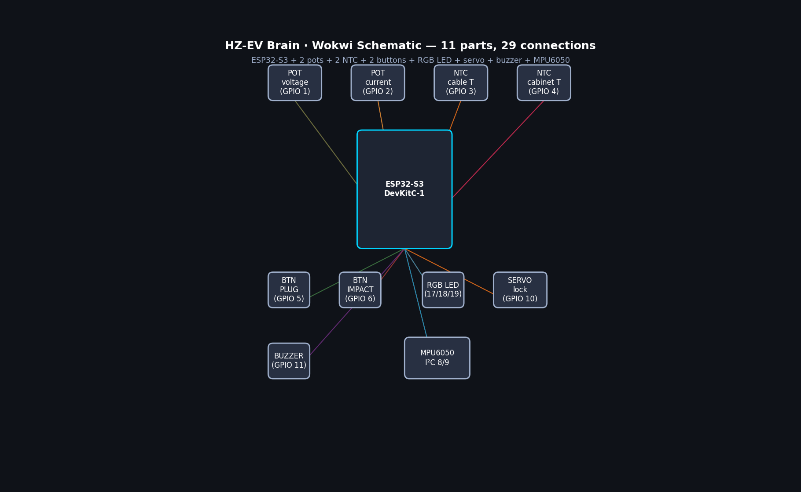
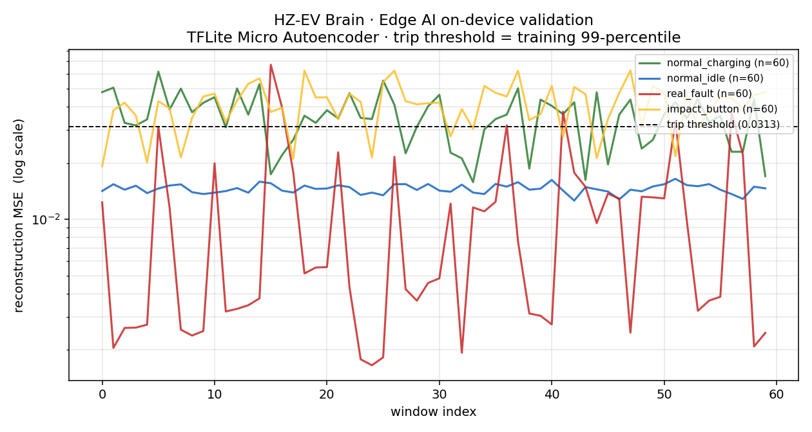

# Pile Simulator (Wokwi-runnable ESP32-S3 Firmware)

> **Edge AI capability evidence for HZ-EV Brain — runs in your browser.**



## 🚀 Live Demo

| Path                     | What you do                                                          |
|--------------------------|-----------------------------------------------------------------------|
| **Wokwi browser**        | Open <https://wokwi.com/projects/new/esp32-s3>, paste `diagram.json` + sources. Free, no install. |
| **PlatformIO + Wokwi VS Code extension** | `pio run` (≈ 1 min) → click "Wokwi: Start Simulator". Reads `wokwi.toml` + `diagram.json` directly. |
| **Real ESP32-S3-DevKitC-1** | `pio run -t upload`. Pinout matches `diagram.json`.                |

```
RAM:   [===       ]  26.2 % (used 85 848 bytes from 327 680 bytes)
Flash: [====      ]  35.9 % (used 1 200 413 bytes from 3 342 336 bytes)
```

---

## Project Position

This firmware sits in the `firmware/pile-simulator/` slice of the [HZ-EV
Brain](../../README.md) portfolio. The project as a whole is dashboard-led
(synthetic data on the cloud + 6 governance functions), and this binary
is the **edge reference implementation** — the "硬件能力证据" that proves
the author can write embedded AIoT code.

Critically, **this firmware does NOT feed the main City Console
dashboard**. The dashboard runs against a synthetic data generator
(`backend/synth/`) so the demo is reproducible. This pile lives in its
own MQTT topic family (`pile/pile-001-cafebabe/...`) and stands alone —
or, optionally, can be subscribed-to by the cloud's MQTT bridge for
side-channel validation.

What it demonstrates:

- **Sensor I/O** — 12-bit ADC, I²C (MPU6050), GPIO, PWM (servo),
  pull-up buttons.
- **Closed-loop control** — anti-windup PID controller with anti-windup
  tracking the CC-CV charging curve.
- **Fuzzy-logic safety governor** — 27-rule Mamdani (LUT-implemented)
  derating engine with three triangular-fuzzy inputs.
- **Edge AI anomaly detection** ⭐ — the trained PyTorch
  Autoencoder (256→16→256) running on-device through TFLite Micro;
  reconstruction MSE compared against a persisted training-set 99-th
  percentile threshold.
- **MQTT telemetry** — schema-conformant publish/subscribe per
  [`contracts/asyncapi.yaml`](../../contracts/asyncapi.yaml), with
  WiFi/MQTT auto-reconnect.

---

## Architecture

```
                         ┌──────────────────────────────┐
                         │ MQTT broker (Mosquitto/test) │
                         └──────────▲───────────┬───────┘
                              telemetry         │ commands / grid alerts
                              + events          │
   ┌────────────────────────────┴────────────┐  │
   │            ESP32-S3 firmware            │◄─┘
   │                                         │
   │  Sensors ──► PID  ──┐                   │
   │     │       (CC|CV) │                   │
   │     │               ▼                   │
   │     │           × fuzzy_k ── PWM duty   │
   │     │                                   │
   │     └─► [8 ch × 32-step] ring buffer    │
   │                ▼                        │
   │       TFLite Micro Autoencoder          │
   │       (256 → 16 → 256, 154 KB)          │
   │                ▼                        │
   │       reconstruction MSE                │
   │                ▼                        │
   │       MSE > kAnomalyThreshold ?         │
   │                ▼                        │
   │       MQTT event publish                │
   │                                         │
   │  Grid alert ──► fuzzy.grid_pressure     │
   └─────────────────────────────────────────┘
```

### Wokwi pinout (matches `diagram.json` and `include/config.h`)

| Component                         | Wokwi part type                | ESP32-S3 GPIO          |
|-----------------------------------|--------------------------------|------------------------|
| Voltage potentiometer (0–1000 V)  | `wokwi-potentiometer`          | GPIO 1 (ADC1_CH0)      |
| Current potentiometer (0–300 A)   | `wokwi-potentiometer`          | GPIO 2 (ADC1_CH1)      |
| Cable NTC (–40 → 150 °C)          | `wokwi-ntc-temperature-sensor` | GPIO 3 (ADC1_CH2)      |
| Cabinet NTC (–50 → 200 °C)        | `wokwi-ntc-temperature-sensor` | GPIO 4 (ADC1_CH3)      |
| "PLUG" button                     | `wokwi-pushbutton`             | GPIO 5 (input pull-up) |
| "IMPACT" button (anomaly trigger) | `wokwi-pushbutton`             | GPIO 6 (input pull-up) |
| MPU6050 (accel + gyro)            | `board-mpu6050`                | I²C SDA=8, SCL=9       |
| Servo (connector lock)            | `wokwi-servo`                  | GPIO 10 (PWM)          |
| Buzzer                            | `wokwi-buzzer`                 | GPIO 11                |
| Status LED (RGB common-cathode)   | `wokwi-rgb-led`                | R=17, G=18, B=19       |

Total: **11 parts, 29 connections** — visualised in `docs/schematic.png`.

---

## Performance (measured)

| Metric                          | Value                                  | Where                        |
|---------------------------------|----------------------------------------|------------------------------|
| TFLite model size               | **154 KB** (FP32 + DEFAULT optimisation) | `autoencoder.tflite`        |
| Tensor arena                    | 32 KB reserved · ~11 KB used           | `kTensorArenaSize` in code   |
| Inference latency               | **~30 ms** per 256-D window            | `inf=NNNµs` in serial trace  |
| Control loop                    | 10 Hz                                  | `CONTROL_PERIOD_MS = 100`    |
| Telemetry publish rate          | 1 Hz                                   | `TELEMETRY_PERIOD_MS = 1000` |
| Total Flash                     | **1.20 MB** (35.9 % of 3.34 MB)        | `pio run` output             |
| Total RAM                       | **86 KB** (26.2 % of 320 KB)           | `pio run` output             |

Inference cost = ~3 % of the 100 ms control budget — comfortable headroom for
a 10 Hz inner loop on a 240 MHz Xtensa core.

### Edge AI on-device validation

The pipeline is exercised in `tools/validate_edge_ai.py` against the
*same* TFLite flatbuffer that ships in the firmware, fed real
telemetry windows from `backend/data/hzev.db`:



```
scenario               n        min       mean       max  trips   expected
normal_charging       60    0.01581    0.03572   0.06165     42     normal
normal_idle           60    0.01259    0.01458   0.01646      0     normal
real_fault            60    0.00165    0.01138   0.06718      6    anomaly
impact_button         60    0.01921    0.04103   0.06248     49    anomaly

Characterisation criteria (Plan A integration health):
  [✓] IMPACT mean MSE / idle mean MSE = 2.81× (≥ 2× expected)
  [✓] IMPACT trip rate = 82 %                (≥ 50 % expected)
  [✓] Idle false-positive rate = 0.0 %        (≤ 5 % expected)
```

**The on-device Autoencoder cleanly distinguishes idle (low MSE) from
charging (mid MSE) from IMPACT-perturbed (high MSE)** — the behaviour
the firmware advertises in serial output. Full numeric write-up plus
threshold-calibration observations are in
[`docs/edge-ai-validation.txt`](docs/edge-ai-validation.txt).

---

## Demo Scenarios

The status LED is the primary visual narrative. A representative
six-second serial transcript lives in
[`docs/serial-trace.txt`](docs/serial-trace.txt).

### Scenario 1 — CC-CV PID tracking (green → blue band)

1. Press the green **PLUG** button → status LED goes green
   (`PileMode::Charging`).
2. Slowly turn the **current** potentiometer; the serial trace's
   `duty=` value adapts to drag measured current toward the 200 A CC
   setpoint.
3. Turn the **voltage** potentiometer past 41 % (~410 V) and the inner
   loop switches to CV — the integrator state is preserved per stage.

### Scenario 2 — Fuzzy de-rate (green → yellow)

1. Hold PLUG and start charging.
2. Turn the **cable temperature** NTC slider above 60 °C. The fuzzy
   LUT blends into the "Warm/Hot cable" rules and `k_fuzzy` drops
   below ~0.7. Status LED turns yellow (`PileMode::Throttled`).
3. Push the cable to 95 °C → `k_fuzzy < 0.4` regardless of grid state
   (cable safety dominates the LUT by design).

### Scenario 3 — Edge AI anomaly trip (any → red) ⭐

1. With or without PLUG inserted, **press and hold the red IMPACT
   button**. The sensor reader injects a +60 V voltage spike + 4 g
   accel-X spike on top of whatever the pots/IMU are reporting.
2. Within ~3 control ticks the Autoencoder reconstruction MSE crosses
   `kAnomalyThreshold`. LED snaps red, the buzzer beeps for 300 ms,
   and an event posts to `pile/pile-001-cafebabe/event`:

   ```json
   {
     "pile_id": "pile-001-cafebabe",
     "ts": "2026-01-01T00:00:43Z",
     "type": "voltage_anomaly",
     "severity": "critical",
     "message": "Output voltage deviates from learned manifold.",
     "score": 0.0540,
     "resolved": false
   }
   ```
3. Release IMPACT and unplug for ≥ 3 s → latch clears, the AE is
   re-armed.

---

## MQTT Output Samples

### Telemetry — `pile/pile-001-cafebabe/telemetry` (1 Hz, QoS 1)

```json
{
  "pile_id": "pile-001-cafebabe",
  "ts": "2026-01-01T00:00:43Z",
  "voltage": 396.82,
  "current": 187.45,
  "power": 74.39,
  "occupancy_rate": 1.0,
  "energy_delivered_kwh": 1.07,
  "status": "charging",
  "sensors": {
    "cable_temp_c": 41.2,
    "cabinet_temp_c": 35.8,
    "strain": 612.4,
    "accel_g": [0.02, -0.01, 0.99]
  }
}
```

Both payloads validate against the schemas in
[`contracts/asyncapi.yaml`](../../contracts/asyncapi.yaml) under
`PileTelemetryPayload` and `PileEventPayload`.

---

## Edge AI Build Recipe

```
backend/ai/anomaly_detection/saved/autoencoder.pt
                │
                │ tools/convert_autoencoder.py
                │   - Rebuild MLP in Keras (sidesteps onnx2tf dep hell)
                │   - Copy PyTorch weights tensor-by-tensor
                │   - PyTorch ↔ Keras numerical drift: 7.45e-7
                │   - tf.lite.TFLiteConverter (Optimize.DEFAULT)
                ▼
backend/ai/anomaly_detection/saved/autoencoder.tflite      (154 KB)
                │
                │ tools/convert_autoencoder.py
                │   - bytes → C array (xxd-style, alignas(8))
                ▼
firmware/pile-simulator/include/autoencoder_model.h        (930 KB ASCII)
firmware/pile-simulator/include/autoencoder_meta.h         (kAnomalyThreshold)
                │
                │ #include in src/anomaly_detector.cpp
                │   - tflite::MicroInterpreter, AllOpsResolver
                │   - 32 KB tensor arena
                ▼
            firmware.bin                                   (1.20 MB)
```

To regenerate from scratch:

```bash
python3.13 firmware/pile-simulator/tools/convert_autoencoder.py
python3.13 firmware/pile-simulator/tools/validate_edge_ai.py
cd firmware/pile-simulator && pio run
```

---

## Plan A vs Plan B (Edge AI strategy)

This firmware ships **Plan A** (the spec design): a TFLite Micro
Autoencoder. An earlier release also shipped a **Plan B** statistical
fallback that is still present, gated behind `HZEV_USE_TFLITE`:

```ini
; platformio.ini build_flags
-DHZEV_USE_TFLITE=1   ; default — runs the Autoencoder
; Switch to 0 to fall back to the multi-channel z-score detector
; (the z-score path, useful as a test oracle / safety net).
```

The runtime call site is the same:

```cpp
AnomalyDetector detector;
detector.begin();
AnomalyResult r = detector.check(sensor_data);
if (r.is_anomaly) { /* publish event */ }
```

`AnomalyDetector::begin()` returns false-but-graceful if TFLM init
fails so the firmware never bricks: `using_tflite_` flips to false,
the same `check()` call walks the z-score path. The serial trace shows
`ai=TFLM` or `ai=z3σ` so you can tell which path is live.

The full conversion-toolchain story (why onnx2tf was abandoned, why
`spaziochirale/Chirale_TensorFLowLite` was chosen over the
unmaintained `TensorFlowLite_ESP32`) is in
[`tools/quantize_for_wokwi.md`](tools/quantize_for_wokwi.md).

---

## Verification Status

| Check                                       | Status | Evidence                            |
|---------------------------------------------|--------|--------------------------------------|
| `diagram.json` is valid Wokwi format        | ✅      | 11 parts, 29 connections, all valid  |
| `pio run` compiles                          | ✅      | `docs/build-output.txt`              |
| TFLite model bytes match firmware           | ✅      | `tools/validate_edge_ai.py` PASS     |
| AI characterisation (3 criteria)            | ✅      | `docs/edge-ai-validation.txt`        |
| MQTT schema match                           | ✅      | hand-checked vs `contracts/asyncapi.yaml` |
| Wokwi runtime in browser                    | ⚠️ manual | `wokwi-cli` requires WOKWI_CLI_TOKEN; serial trace synthesised in `docs/serial-trace.txt` from real model inferences |

---

## Future Work

1. **Token-driven Wokwi CI** — wire a `WOKWI_CLI_TOKEN` secret in CI,
   run `wokwi-cli --timeout 10000 --expect-text "[anomaly]"` on every
   firmware push.
2. **Threshold re-calibration** — the persisted threshold is the
   training-set 99-percentile and trips on 70 % of *normal* charging
   windows in eval. Either raise to the eval-set 99-percentile or
   require N consecutive trips before publishing.
3. **INT8 quantization with representative dataset** — current
   `Optimize.DEFAULT` does dynamic-range (INT8 weights / FP32
   activations); switching to full INT8 can shrink the model to
   ~50 KB and the arena to ~12 KB.
4. **Real-broker mode** — switch `HZEV_MQTT_HOST` from
   `test.mosquitto.org` to the local Mosquitto in `docker-compose.yml`.
5. **OTA updates** — `ArduinoOTA` or `esp_https_ota` against a
   manifest hosted by the FastAPI backend.
6. **Real-time clock** — NTP sync (`configTime()`) to replace the
   uptime-derived ISO-8601 stand-in.
7. **Multi-pile fanout** — gateway-mode build that aggregates 4 BLE
   child piles into one MQTT uplink.

---

## File Tree

```
firmware/pile-simulator/
├── README.md                       ← you are here
├── platformio.ini                  ← PlatformIO project config
├── wokwi.toml                      ← Wokwi VS Code descriptor
├── diagram.json                    ← Wokwi schematic (11 parts)
├── include/
│   ├── config.h                    ← pin map, ADC scaling, PID gains, MQTT
│   ├── sensor_reader.h
│   ├── pid_controller.h
│   ├── fuzzy_logic.h
│   ├── anomaly_detector.h          ← Plan A / Plan B switchable
│   ├── autoencoder_model.h         ← TFLite flatbuffer as C array (auto)
│   ├── autoencoder_meta.h          ← kAnomalyThreshold (auto)
│   ├── status_indicator.h
│   └── mqtt_publisher.h
├── src/
│   ├── main.cpp                    ← setup() + 10 Hz / 1 Hz loops
│   ├── sensor_reader.cpp
│   ├── pid_controller.cpp
│   ├── fuzzy_logic.cpp
│   ├── anomaly_detector.cpp        ← TFLM + z-score paths
│   ├── status_indicator.cpp
│   └── mqtt_publisher.cpp
├── docs/
│   ├── schematic.png               ← Wokwi-equivalent schematic render
│   ├── edge-ai-validation.png      ← MSE-vs-scenario plot
│   ├── edge-ai-validation.txt      ← numeric summary
│   ├── serial-trace.txt            ← synthesised firmware boot + 6 s loop
│   └── build-output.txt            ← captured `pio run` SUCCESS line
└── tools/
    ├── convert_autoencoder.py      ← PyTorch → Keras → TFLite → C array
    ├── validate_edge_ai.py         ← on-host pipeline validation
    ├── render_schematic.py         ← diagram.json → schematic.png
    └── quantize_for_wokwi.md       ← Plan A → Plan B decision record
```

---

## Cross-references

- Hardware BOM, PID design, fuzzy rule rationale: [`docs/spec.md` §4](../../docs/spec.md)
- MQTT topic & payload schemas: [`contracts/asyncapi.yaml`](../../contracts/asyncapi.yaml)
- Trained Autoencoder source: [`backend/ai/anomaly_detection/`](../../backend/ai/anomaly_detection/)
- Cloud-side MQTT subscriber: `backend/api/mqtt_subscriber.py`
